<div align="center">

# 🥗 Système de Nutrition Intelligente

**Moteur de recommandations nutritionnelles personnalisées, scientifiquement fondées et réalistes**

[](https://www.typescriptlang.org/)
[](https://nodejs.org/)
[](https://expressjs.com/)
[](https://zod.dev/)
[](https://vitest.dev/)
[](docker-compose.yml)
[](LICENSE)
[](CONTRIBUTING.md)

[Démo](#-démo-en-direct) · [Installation](#-installation-rapide) · [Comment ça marche](#-comment-ça-marche) · [API](#-api-reference) · [Tests](#-tests)

</div>

---

> ⚠️ **Disclaimer médical** : Ce système est à visée éducative et préventive uniquement. Il ne remplace pas un avis médical ou nutritionnel professionnel.

---

## 📋 Table des Matières

- [Pourquoi ce projet](#-pourquoi-ce-projet)
- [Démo en direct](#-démo-en-direct)
- [Comment ça marche](#-comment-ça-marche)
- [Le moteur de calcul](#-le-moteur-de-calcul-étape-par-étape)
- [Garde-fous de sécurité](#-garde-fous-de-sécurité)
- [Comparaison de profils](#-comparaison-de-profils)
- [Architecture](#-architecture)
- [Stack Technologique](#-stack-technologique)
- [Installation Rapide](#-installation-rapide)
- [API Reference](#-api-reference)
- [Tests](#-tests)
- [Déploiement](#-déploiement)
- [Contribution](#-contribution)
- [Licence](#-licence)

---

## 🎯 Pourquoi ce projet ?

La plupart des calculateurs nutritionnels en ligne donnent des résultats **génériques et opaques**. Ce projet propose un moteur transparent, explicable et sécurisé :

| Problème courant | Ce que fait ce système |
|-----------------|----------------------|
| "Mangez 2000 kcal" sans explication | Chaque valeur est calculée + justifiée scientifiquement |
| Formules non documentées | Mifflin-St Jeor (1990), classification OMS — références publiées |
| Pas de protection contre les régimes dangereux | Plancher calorique 1200/1500 kcal selon le sexe |
| Résultats identiques pour tout le monde | 8 paramètres personnalisés : sexe, âge, taille, poids, activité, objectif |
| Données de santé stockées | Traitement en mémoire uniquement, aucune persistance |

---

## 🎬 Démo en direct

### Résultat d'analyse — Dashboard complet

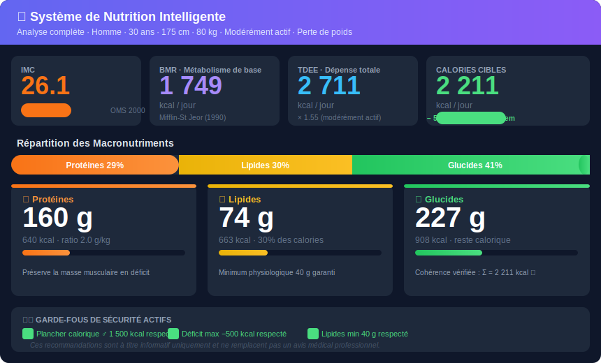

### Comparaison de 4 profils — même API, résultats uniques

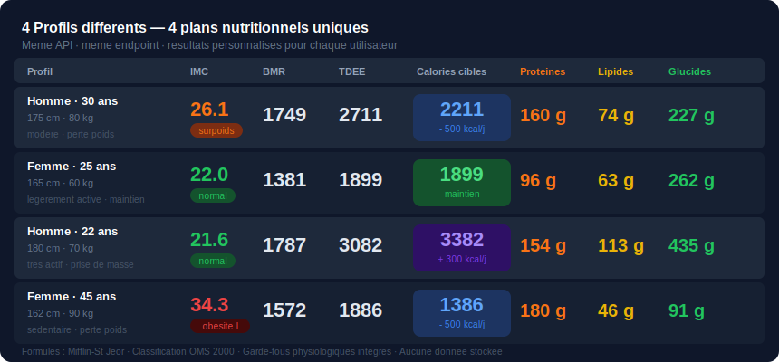

### Requête & réponse JSON

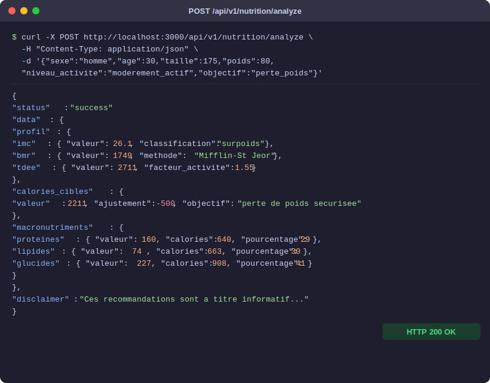

### Validation — Réponse en cas de profil invalide

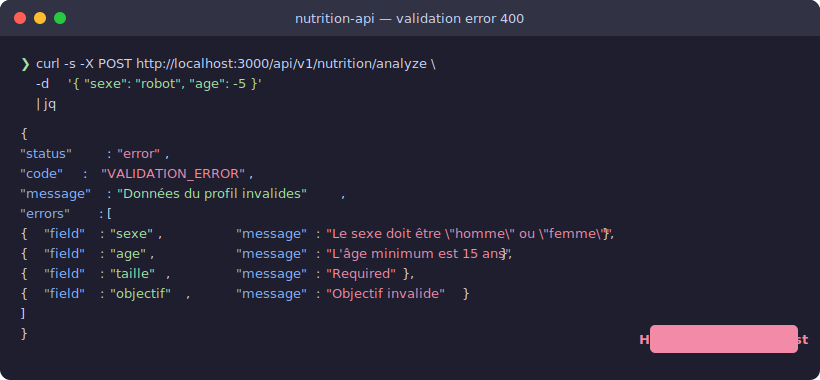

---

<details>
<summary>📋 Voir les exemples en texte brut</summary>

### Requête

```bash
curl -s -X POST http://localhost:3000/api/v1/nutrition/analyze \
  -H "Content-Type: application/json" \
  -d '{
    "sexe": "homme",
    "age": 30,
    "taille": 175,
    "poids": 80,
    "niveau_activite": "moderement_actif",
    "objectif": "perte_poids"
  }' | jq
```

### Réponse complète

```json
{
  "status": "success",
  "data": {
    "profil": {
      "imc": {
        "valeur": 26.1,
        "classification": "surpoids",
        "reference": "Classification OMS 2000"
      },
      "bmr": {
        "valeur": 1749,
        "unite": "kcal/jour",
        "methode": "Mifflin-St Jeor",
        "explication": "Énergie minimale au repos pour un homme de 30 ans, 175 cm, 80 kg"
      },
      "tdee": {
        "valeur": 2711,
        "unite": "kcal/jour",
        "facteur_activite": 1.55,
        "niveau": "modérément actif·ve"
      }
    },
    "calories_cibles": {
      "valeur": 2211,
      "unite": "kcal/jour",
      "ajustement": -500,
      "objectif": "perte de poids sécurisée (≈ 0.5 kg/semaine)"
    },
    "macronutriments": {
      "proteines": {
        "valeur": 160,
        "unite": "g",
        "calories": 640,
        "pourcentage": 29,
        "ratio_par_kg": 2.0
      },
      "lipides": {
        "valeur": 74,
        "unite": "g",
        "calories": 663,
        "pourcentage": 30
      },
      "glucides": {
        "valeur": 227,
        "unite": "g",
        "calories": 908,
        "pourcentage": 41
      }
    }
  },
  "disclaimer": "Ces recommandations sont à titre informatif et ne remplacent pas un avis médical, diététique ou nutritionnel professionnel."
}
```

</details>

---

## ⚙️ Comment ça marche

Le moteur exécute **8 use cases en chaîne**, chacun alimentant le suivant :

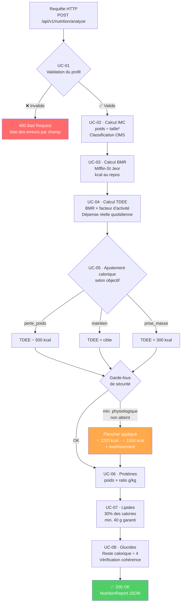

---

## 🔬 Le Moteur de Calcul — Étape par Étape

Voici comment le système transforme **6 paramètres** en **un plan nutritionnel complet** :

### Profil exemple : Femme, 28 ans, 62 kg, 168 cm, légèrement active, perte de poids

```
┌─────────────────────────────────────────────────────────────────┐
│  ÉTAPE 1 — IMC (UC-02)                                          │
│                                                                 │
│  IMC = 62 ÷ (1.68)² = 21.97  →  ✅ NORMAL (18.5 – 24.9)        │
│                                   Référence : OMS 2000          │
└─────────────────────────────────────────────────────────────────┘
                              ↓
┌─────────────────────────────────────────────────────────────────┐
│  ÉTAPE 2 — BMR / Métabolisme de base (UC-03)                    │
│                                                                 │
│  Mifflin-St Jeor (femme) :                                      │
│  BMR = (10 × 62) + (6.25 × 168) − (5 × 28) − 161              │
│      =  620   +   1050      −   140    − 161                    │
│      =  1369 kcal/jour                                          │
└─────────────────────────────────────────────────────────────────┘
                              ↓
┌─────────────────────────────────────────────────────────────────┐
│  ÉTAPE 3 — TDEE / Dépense totale (UC-04)                        │
│                                                                 │
│  TDEE = BMR × facteur légèrement active                         │
│       = 1369 × 1.375 = 1882 kcal/jour                          │
└─────────────────────────────────────────────────────────────────┘
                              ↓
┌─────────────────────────────────────────────────────────────────┐
│  ÉTAPE 4 — Calories cibles (UC-05)                              │
│                                                                 │
│  Objectif perte de poids → déficit de 500 kcal                 │
│  Cible = 1882 − 500 = 1382 kcal/jour                           │
│                                                                 │
│  🛡️  Vérification plancher femme : 1382 > 1200 ✅ → OK         │
│  Perte estimée : ≈ 0.5 kg / semaine                             │
└─────────────────────────────────────────────────────────────────┘
                              ↓
┌─────────────────────────────────────────────────────────────────┐
│  ÉTAPE 5 — Macronutriments (UC-06 / UC-07 / UC-08)              │
│                                                                 │
│  Protéines : 62 kg × 2.0 g/kg = 124 g  →  496 kcal  (36%)     │
│  Lipides   : 1382 × 30% ÷ 9   =  46 g  →  415 kcal  (30%)     │
│  Glucides  : (1382 − 496 − 415) ÷ 4    =  118 g  (34%)        │
│                                                                 │
│  Σ = 496 + 415 + 471 = 1382 kcal ✅                             │
└─────────────────────────────────────────────────────────────────┘
```

---

## 🛡️ Garde-fous de Sécurité

Le système refuse les recommandations physiologiquement dangereuses :

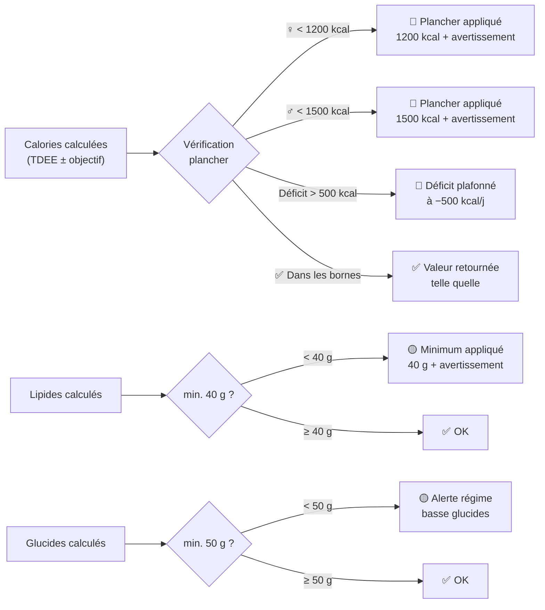

---

## 📊 Comparaison de Profils

Le système s'adapte à chaque profil. Voici 4 exemples réels :

| Profil | IMC | BMR | TDEE | Calories cibles | Protéines | Lipides | Glucides |
|--------|-----|-----|------|----------------|-----------|---------|---------|
| ♂ 30 ans · 80 kg · 175 cm · modéré · **perte** | 26.1 surpoids | 1749 | 2711 | **2211** | 160 g | 74 g | 227 g |
| ♀ 25 ans · 60 kg · 165 cm · léger · **maintien** | 22.0 normal | 1381 | 1899 | **1899** | 96 g | 63 g | 262 g |
| ♂ 22 ans · 70 kg · 180 cm · très actif · **prise masse** | 21.6 normal | 1787 | 3082 | **3382** | 154 g | 113 g | 435 g |
| ♀ 45 ans · 90 kg · 162 cm · sédentaire · **perte** | 34.3 obésité I | 1572 | 1886 | **1386** | 180 g | 46 g | 91 g |

> Chaque ligne est le résultat d'un appel API — même endpoint, profils différents.

---

## 🏗️ Architecture

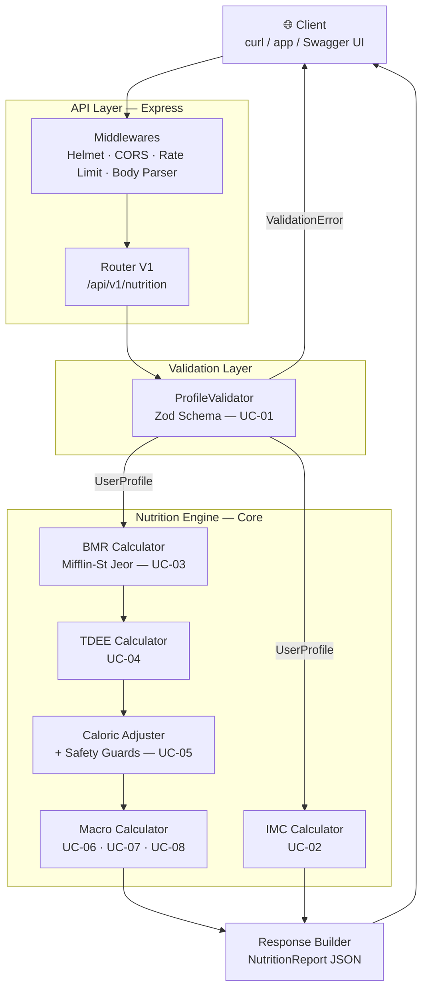

Voir [ARCHITECTURE.md](ARCHITECTURE.md) pour les décisions techniques et références scientifiques.

---

## 🛠️ Stack Technologique

| Couche | Technologie | Rôle |
|--------|-------------|------|
| **Runtime** | Node.js 20 LTS | Environnement d'exécution |
| **Langage** | TypeScript 5 strict | Typage statique, zéro `any` |
| **Framework** | Express 4 | Serveur HTTP / Router |
| **Validation** | Zod 3 | Schémas typés, messages en français |
| **Sécurité** | Helmet + express-rate-limit | Headers + protection DoS |
| **Tests** | Vitest + Supertest | Unitaires & intégration |
| **Qualité** | ESLint + Prettier | Lint + formatage |
| **Documentation** | Swagger UI + OpenAPI 3.0 | API interactive |
| **Conteneurisation** | Docker multi-stage | Dev / Prod isolés |
| **CI/CD** | GitHub Actions | Lint · Tests · Build · Audit |

---

## 🚀 Installation Rapide

### Via Docker (recommandé)

```bash
git clone https://github.com/Anasoufkir/Syst-me-de-Nutrition-Intelligente.git
cd Syst-me-de-Nutrition-Intelligente
cp .env.example .env
docker compose up -d
```

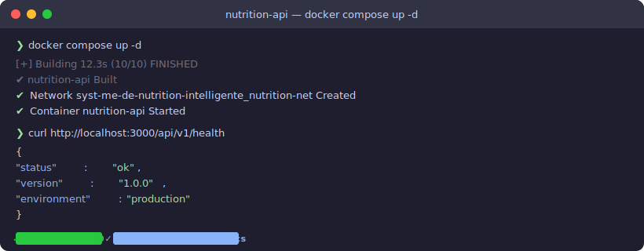

### Installation manuelle

```bash
git clone https://github.com/Anasoufkir/Syst-me-de-Nutrition-Intelligente.git
cd Syst-me-de-Nutrition-Intelligente
npm install
cp .env.example .env
npm run build
npm start
```

Guide complet → [SETUP.md](SETUP.md)

---

## 📚 API Reference

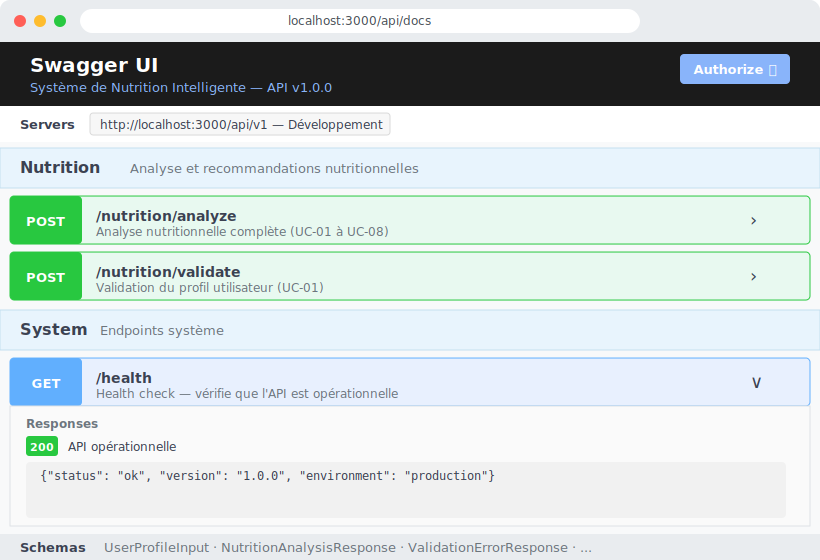

Documentation interactive : `http://localhost:3000/api/docs` · Spec YAML : [`docs/api/openapi.yaml`](docs/api/openapi.yaml)

### Endpoints

| Méthode | Endpoint | Description |
|---------|----------|-------------|
| `GET`  | `/api/v1/health` | Health check |
| `POST` | `/api/v1/nutrition/validate` | Validation du profil (UC-01) |
| `POST` | `/api/v1/nutrition/analyze` | Analyse nutritionnelle complète (UC-01→08) |

### Corps de la requête

```typescript
{
  sexe:            "homme" | "femme"
  age:             number   // 15 – 120 ans
  taille:          number   // 100 – 250 cm
  poids:           number   // 30 – 300 kg
  niveau_activite: "sedentaire" | "legerement_actif" | "moderement_actif"
                 | "tres_actif" | "extremement_actif"
  objectif:        "perte_poids" | "maintien" | "prise_masse"
}
```

---

## 🧪 Tests

```bash
npm test              # tous les tests
npm run test:coverage # rapport de couverture (cible ≥ 80%)
```

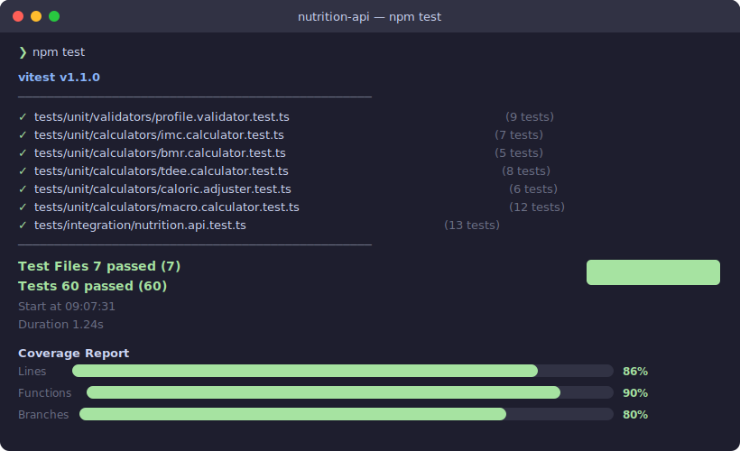

### Couverture actuelle

| Module | Tests | Cas couverts |
|--------|-------|-------------|
| `profile.validator` | 9 tests | Champs manquants, bornes min/max, valeurs invalides |
| `imc.calculator` | 7 tests | 8 classifications OMS, arrondi, référence |
| `bmr.calculator` | 5 tests | Formule homme/femme, explication, entier |
| `tdee.calculator` | 8 tests | 5 niveaux d'activité, monotonicité, entier |
| `caloric.adjuster` | 6 tests | 3 objectifs, planchers ♀/♂, avertissement |
| `macro.calculator` | 12 tests | Ratios protéines, 9 kcal/g lipides, reste glucides, cohérence |
| **API (intégration)** | **13 tests** | Happy path, erreurs 400, plancher sécurité, TDEE > BMR |
| **Total** | **60 tests** | |

### Pipeline CI

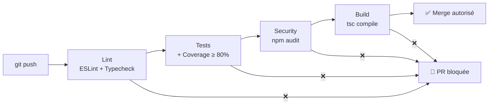

---

## 🚢 Déploiement

Guides complets dans [DEPLOYMENT.md](DEPLOYMENT.md) :

| Méthode | Commande |
|---------|---------|
| Docker production | `docker compose up -d --build` |
| VPS + PM2 | `pm2 start dist/app.js --name nutrition-api` |
| Nginx reverse proxy | Voir [DEPLOYMENT.md#nginx](DEPLOYMENT.md#reverse-proxy-nginx) |
| HTTPS (Certbot) | Voir [DEPLOYMENT.md#https](DEPLOYMENT.md#https-avec-certbot) |

---

## 🤝 Contribution

Les contributions sont les bienvenues. Voir [CONTRIBUTING.md](CONTRIBUTING.md) pour les conventions de code, le format des commits et le processus de PR.

---

## 🔒 Sécurité

Pour signaler une vulnérabilité → [SECURITY.md](SECURITY.md)

---

## 📄 Licence

MIT — voir [LICENSE](LICENSE)

---

<div align="center">

Développé par [Anasoufkir](https://github.com/Anasoufkir)

</div>
